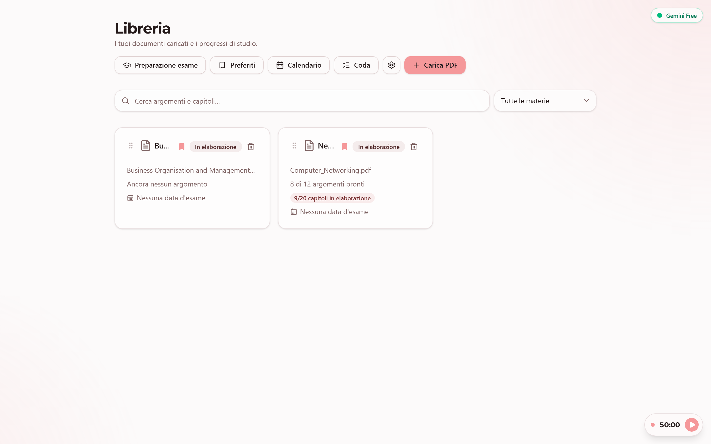
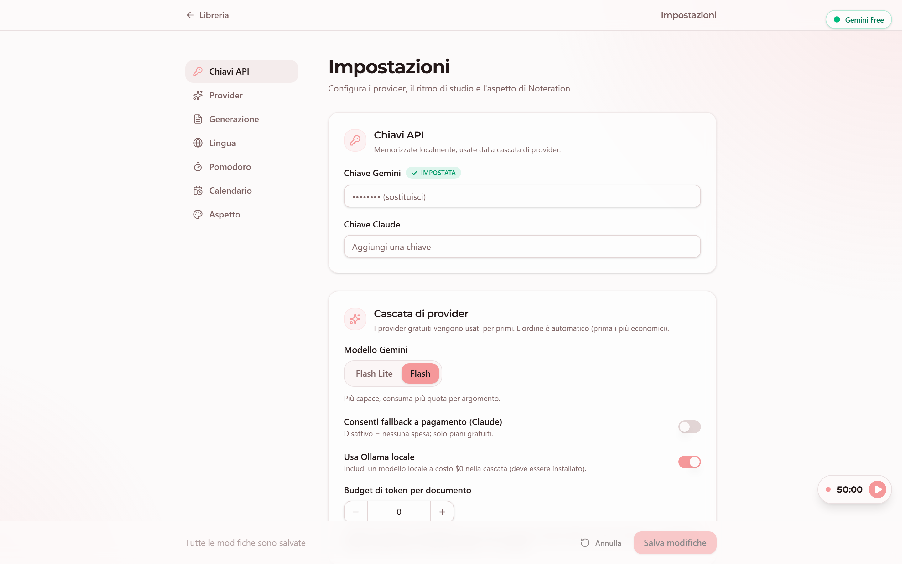
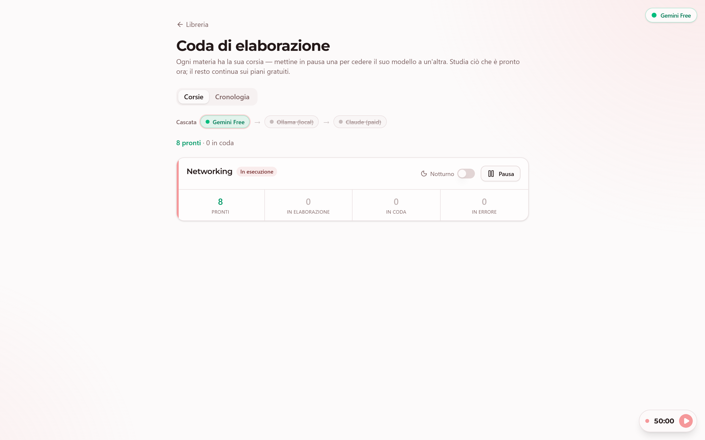

# Noteration 

**Turn your study ugly ah PDFs into astonishing notes and much more**

Noteration is a local desktop app made by a student for students. Drop in a lecture, textbook chapter, or slide deck, and it generates clean notes, multiple-choice quizzes, and flashcards, then plans your revision with the SM-2 spaced-repetition algorithm. No accounts, your files never leave your machine (I don't know how to steal data .-. ) and it's built to stay **free to run** because i know you are a brokie like me.



---

## Features

### Study material, generated for you
- **PDF → structured course.** Upload a PDF and Noteration detects its chapters and topics — from real headings, the PDF's embedded outline/bookmarks, or a font-size heuristic for heading-less slide decks. You review and tweak the structure before anything is generated.
- **AI notes** per topic, scoped to just that topic's source text to keep them focused (and cheap).
- **Formula vision.** Math regions are detected, cropped from the page, and transcribed to LaTeX, then rendered with KaTeX.
- **Quizzes & flashcards.** Auto-generated multiple-choice questions (with explanations) and flashcards for every topic. Generate more on demand, or regenerate notes you're not happy with.
- **Audio & attachments.** Transcribe uploaded audio into notes, and attach your own images/files to a topic.

### Learn & retain
- **Study view** with three tabs per topic: **Notes** (Markdown + math), **Quiz** (one question at a time, reveal answers, scored), and **Flashcards** (flip + self-grade).
- **SM-2 spaced repetition** schedules each card's next review automatically.
- **Deadline mode.** Set an exam date and Noteration compresses your schedule so nothing lands after the exam, with a revision buffer at the end.
- **Calendar** (month grid) of your scheduled sessions, color-coded, with drag-and-drop rescheduling.
- **Pomodoro timer** that floats above the app as you work, with synthesized ambient sounds (rain / sea) or your own audio, and a chime on each phase.

### Organize
- **Library** with full-text search across topics and chapters, **bookmarks**, drag-and-drop reordering, and delete.
- **Multi-language UI** (i18n).
- **Customizable appearance** — light/dark theme, an accent-color palette that re-themes the whole UI, font family, and font size.



### Free by design
- **Cheapest-first AI "waterfall."** Calls go to **Gemini's free tier** first, with optional fallback to a local **Ollama** model ($0) or **paid Claude** as a last resort (which you can hard-disable). The app never knows or cares which model answered.
- **Budget-aware background queue.** Topics are generated in the background, committed one at a time, and the queue automatically fails over, backs off, and resumes when a provider's quota cools down — so you never lose work and never get a half-written topic.
- **Cost guards.** A per-document token estimate and an optional budget cap stop a single PDF from burning your daily free quota.



---

## Download & install

Grab the latest installer from the [**Releases page**](https://github.com/Smaldy/Noteration/releases/latest):

| OS | File |
|---|---|
| Windows 10/11 | `Noteration-Setup-<version>.exe` |
| macOS (Apple Silicon) | `Noteration-macOS.dmg` |

Everything is bundled — the recipient installs nothing else. Full step-by-step (including the one-time "unsigned app" click-through and getting a free Gemini key) is in the [**User Guide**](packaging/USER-GUIDE.md).

> The app is currently **unsigned**, so the first launch shows a standard OS warning (Windows: *More info → Run anyway*; macOS: *right-click → Open*). It's safe — everything runs locally.

---

## How it works

```
PDF ─▶ Ingestion ─▶ Structure ─▶ [ you review ] ─▶ Queue ─▶ Notes + Formulas + Quiz/Flashcards ─▶ SM-2 schedule
     (markdown +     (chapters/                     (budget-     (cheapest-first provider waterfall)
      page renders,   topics)                        aware,
      hash-cached)                                   background)
```

A Python backend (FastAPI) runs the pipeline, the budget-aware queue, and the AI calls, and serves the React frontend; everything persists to a local SQLite database (WAL mode). In the packaged app, a small launcher boots the server on a free localhost port and shows it in a native desktop window (no terminal, no browser chrome).

## Tech stack

**Backend:** Python · FastAPI · SQLAlchemy · Alembic · SQLite (WAL) · PyMuPDF · markitdown

**AI:** provider abstraction over Gemini (google-genai), Claude (anthropic), and Ollama

**Frontend:** React · Vite · TypeScript · Tailwind · shadcn/ui · Zustand · Framer Motion · FullCalendar · KaTeX

**Desktop:** PyInstaller + pywebview; Inno Setup (Windows) / `.dmg` via GitHub Actions (macOS)

## Run from source (developers)

```bash
# Backend
python -m venv .venv && .venv/Scripts/activate      # (use source .venv/bin/activate on macOS/Linux)
pip install -r backend/requirements.txt
python -m backend.migrate                            # create/upgrade the local DB

# Frontend
npm ci && npm run build                              # build the bundle the backend serves
uvicorn backend.main:app                             # open http://127.0.0.1:8000

# Tests
.venv/Scripts/python.exe -m pytest                   # backend suite
```

For building the desktop installers, see [`packaging/README.md`](packaging/README.md).


## Privacy

Everything runs locally. Your PDFs, notes, and database stay on your machine (`%LOCALAPPDATA%\Noteration` on Windows, `~/Library/Application Support/Noteration` on macOS). The only outbound calls are the AI requests you enable, sent directly to your chosen provider with your own API key.
